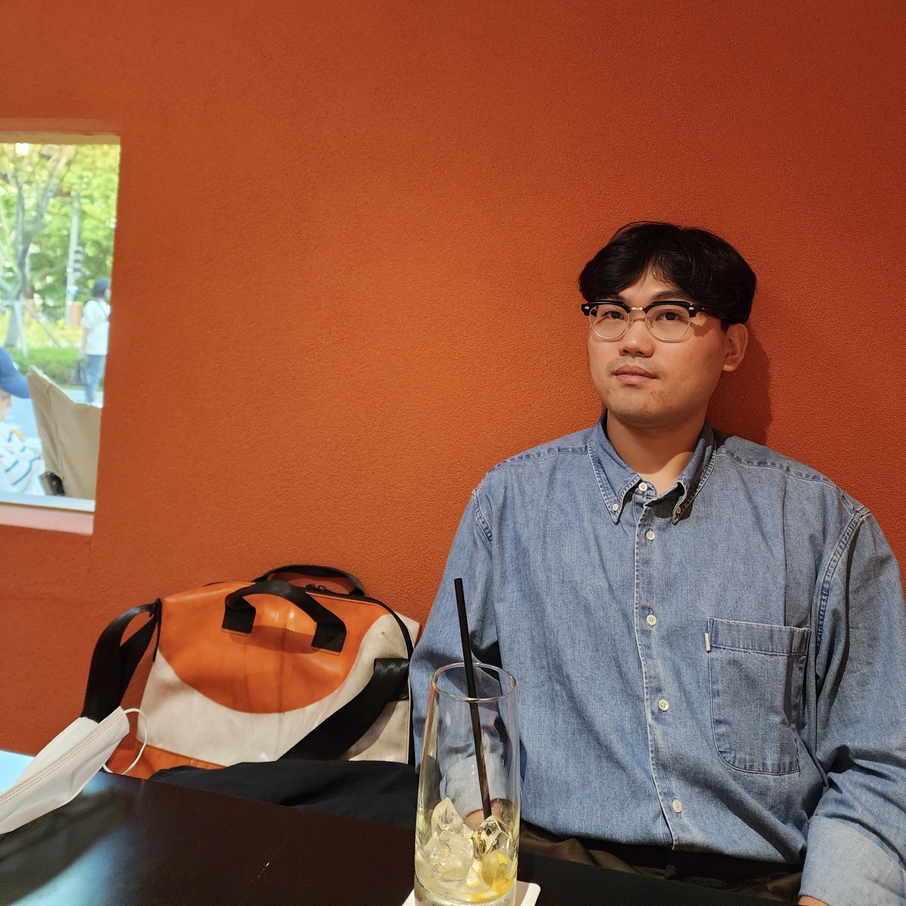

# 안녕하세요. 문기영입니다!

### 목표는 **Specialist**.

📮 E-mail
ans92175@gmail.com

🎨관심 분야

`Robotics` `Autonomous Driving` 

`Computer Vision` `Embeded` 

`SLAM` `Visual Odometry` `Camera Geometry`

# 👨‍💻 About Me

---

## 🛠 Stacks

### 🎛 Electrical/Embedded

- `Ladder` 프로그래밍으로 미쯔비시 `PLC`를 다룰 수 있습니다.
- `Arduino Sketch`를 이용해 `Arduino GPIO`를 제어할 수 있습니다.
- `Raspberry Pi`와 `Raspberry Pi OS`를 이용해 GPIO를 제어할 수 있습니다.
- 임베디드 보드를 이용해 모터를 PWM으로 제어할 수 있습니다.

### ⚙️ Mechanical

- `AutoCAD`를 이용해 도면을 보고 따라 그릴 수 있을 정도의 2차원 설계를 할 수 있습니다.
- 2차원 도면을 갖고 `SolidWorks`로 3차원 모델링을 하고 시뮬레이션을 돌릴 수 있습니다.

### 🖥 Programming

- `Python`으로 원하는 기능을 프로그래밍할 수 있습니다.
    - 인터프리터에 대해 이해하고 있습니다.
    - Django, Matplotlib, Pandas, Numpy, TensorFlow 등의 패키지를 사용할 수 있습니다.
- `Java`를 이용해 `Android` application을 개발할 수 있습니다.
    - 객체지향 프로그래밍에 대해 이해하고 있습니다.
    - 디자인패턴에 대해 이해하고 있습니다.
    - `Firebase`와 연동해 통신할 수 있습니다.
- `Flutter`로 `Android` application을 개발할 수 있습니다.
    - Provider를 이용해 데이터를 관리할 수 있습니다.
    - `Firebase`와 연동해 통신할 수 있습니다.
- `C#`으로 `.NET Framework` 개발을 할 수 있습니다.
- `C` 언어로 프로그래밍을 할 수 있습니다.
    - 절차지향 프로그래밍을 이해하고 있습니다.
    - 컴퓨터 메모리 구조에 대해 이해하고 있습니다.
    - 포인터를 활용해 프로그래밍을 할 수 있습니다.

## 🧑‍🎓 Education

`2023.03 ~`  인하대학교 전기컴퓨터공학과 미래형자동차전공 석사 과정 중

`2022.03 ~ 2023.02` 동양미래대학교 로봇자동화공학부 자동화공학과(학사 과정) 수석 졸업

`2017.03 ~ 2022.02` 동양미래대학교 로봇자동화공학부 로봇공학과 차석 졸업

## 👨‍🏭 Career

`2022.01 ~ 2022.12`  동양미래대학교 로봇자동화공학부 시설담당 조교

## 💁‍♂️ External/Internal Activities

| `2023.09 ~ 2023.12` | 인하대학교 객체지향프로그래밍1 수업 조교 |
| --- | --- |
| `2023.03 ~ 2023.08` | 인하대학교 객체지향프로그래밍2 수업 조교 |
| `2020.03 ~ 2021.12` | 전공동아리 SMART 팀장 및 프로그램(앱) 담당 |
| `2020.09 ~ 2021.12` | 근로장학생 |
| `2021.03 ~ 2021.08` | 전공 튜터링 튜터(전자회로 및 실습) |
| `2020.09 ~ 2020.12` | 전공 튜터링 튜터(컴퓨터 프로그래밍) |
| `2020.07 ~ 2020.12` | 대우조선해양 외부연구용역 App 담당 |

## 🏆 Awards

[scan version link](https://www.notion.so/scan-version-link-409f03d5d61545b2847d0bbb2f8569cd?pvs=21)

| 수상 명 | 주최 | 수상 일자 |
| --- | --- | --- |
| 창업 아이디어 경진대회 동상 | 영남이공대학교 | 20.07 |
| 제 7회 ICT 스마트디바이스 전국공모전 우수상 | 과학기술정보통신부 | 20.09 |
| 제 5회 정밀공학 창의경진대회 장려상 | 한국정밀공학회 | 20.09 |
| 창의적 공학설계 경진대회 최우수상 | 동양미래대학교 | 20.10 |
| 창의적 종합설계 경진대회 예선 동상 | 영남이공대학교 | 20.11 |
| 창의적 종합설계 경진대회 특별상 | 산업통상자원부 | 20.11 |
| 기술 창업 아이디어 경진대회 우수상 | 동양미래대학교 | 20.12 |
| 제 38회 졸업작품전시회 최우수상 | 동양미래대학교 | 20.12 |
| 신산업 기반 창의적종합설계 경진대회 최우수상 | 동양미래대학교 | 20.12 |
| 캡스톤 디자인 경진대회 최수우상 | 동양미래대학교 | 21.02 |
| 기술창업 아이디어 경진대회 우수상 | 동양미래대학교 | 21.06 |
| 표창 | 한국전문대학교교육협의회 | 22.02 |
| 특별상(차석상) | 동양미래대학교 | 22.02 |
| 수석상 | 동양미래대학교  | 23.02 |

## 🧑‍🤝‍🧑 Team Projects

### 창의 공학 기초

---

| 수행 과제 | 다족 보행 로봇 |
| --- | --- |
| 담당 역할 | 팀장 및 설계 |
| 수행 기간 | 2019.09 ~ 2019.12 |
| 개발 환경 | `AutoCAD` `SolidWorks`  |
| 작품 목표 | 바퀴를 사용하지 않고 모터 하나로 앞으로 전진하는 로봇을 제작 |
| 작품 개요 | Jansen Mechanism을 이용한 다족 보행 로봇 제작 |
| 과제 후기 | 처음 설계를 하다보니 볼트, 너트, 축 등을 고려하지 않아 제작에 어려움을 겪었다. 이후 다시 설계하여 제작하였으나 다리 사이 고정이 불안정해 제대로 걷지 못했다. 팀원들과 자주 회의를 했지만 교수님의 지도를 제대로 이해하지 못해 아쉬웠다. 이후 교수님의 지도로 제대로 걸을 수 있는 로봇을 제작할 수 있었다. |

Janssen Mechanism을 SolidWorks로 구현

Janssen Mechanism이 적용된 다족 보행 로봇 도면

### 캡스톤 디자인 및 대회 출품작

---

[2020_창의과제기초_최종보고서_SMART.pdf](https://drive.google.com/file/d/1fmUJ69v9TpA15YjHOG7TKVyhbT7mkuXj/view?usp=sharing)

| 수행 과제 | 신호등이 없는 횡단보도에서 사고 방지를 위한 인공지능 기반의 이동형 로봇 시스템 |
| --- | --- |
| 담당 역할 | 팀장, 앱 |
| 수행 기간 | 2020.03 ~ 2020.09 |
| 개발 환경  | `Arduino` `Raspberry Pi` `Flutter` `Android` `Firebase` |
| 작품 목표 | 어린이 보호구역에서 교통 사고 예방, 지역간 교통 인프라 격차 해소 |
| 작품 개요 | 인공지능으로 학습된 로봇이 신호등이 없는 횡단보도에서 차량을 통제해 교통사고를 예방한다. 로봇이 보행로를 막고 있다가 보행자를 인지하면 로봇 팔과 머리 위 신호로 차량을 통제한다. 로봇(`Raspberry Pi`)에서 데이터를 토대로 상황을 판단하면 `Arduino`로 모터와 회로를 제어한다. 해당 정보는 실시간으로 `Firebase`로 전송되어 관리자가 `Android` Applicaion으로 로봇 주변 상황을 파악할 수 있다. |
| 과제 후기 | 사회 문제를 해결하기 위해 팀원들과 함께 작품을 만들며 다양한 경험을 할 수 있었다. `Android` Application 개발을 처음하게 되어 어려움이 많았다. `Firebase`에서 값을 읽을 때 해당 인스턴스가 종료되면 읽어온 데이터도 사라져 활용하는데 어려움이 있었지만 앱에서 최대한 데이터 처리를 지양하고 정보를 표시하는 책임만 부여했다. 그렇게 따로 `Python` 서버를 두어 기상청 API, 로봇에서 데이터를 처리한 뒤 Application에 띄울 문자열을 그대로 `Firebase`에 업로드한다. |

신호등이 없는 횡단보도에서 사고 방지를 위한 인공지능 기반의 이동형 로봇 시스템 전체 개요도

`Flutter`로 제작한 `Android` Application. 기상청 API를 사용해 실시간으로 날씨를 알 수 있고 YouTube Live Streaming으로 주변 상황을 실시간으로 볼 수 있다.

제작 과제 사진

로봇을 제작 중인 모습

### 졸업 작품전 및 캡스톤 디자인

---

[2020_최종보고서_SMART팀_창의과제응용.pdf](https://drive.google.com/file/d/1UlAftE862n1UsfzA7bcCVpyYoHgr9W4H/view?usp=sharing)

[2021 캡스톤 최종보고서 최종.pdf](https://drive.google.com/file/d/13EaYy-fi9iRPmctmDZry-ivjBeVGoRW7/view?usp=sharing)

| 수행 과제 | SLAM과 인공지능 기반의 시각장애인 안내 4족 보행 로봇 시스템 |
| --- | --- |
| 담당 역할 | 팀장, 앱 |
| 수행 기간 | 2020.09 ~ 2021.08 |
| 개발 환경 | `Java` `Android` `Python` `Raspberry Pi` `ROS` `Firebase` |
| 작품 목표 | 저조한 시각장애인 안내견 보급 문제 해결 |
| 작품 개요 | 기존 시각 장애인 안내견보다 경제성이 우수한 4족 보행 로봇이 시각장애인을 목적지까지 안내 |
| 과제 후기  | 해당 작품에서 Appcation은 시각 장애인을 대상으로 서비스를 제공하기 때문에 TTS/STT 기능이 필수로 들어가야했다. 작품 계획 당시 `Flutter`에서 한국어 TTS/STT 기능을 지원하지 않아 `Java`로 `Android` Application 개발을 했다. 동시에 `ROS` 와의 연동을 위해 `Android Room`을 활용했고 자연스럽게 MVVM 패턴을 공부하여 적용하였다. Application은 로봇이 수집한 정보를 시각장애인에게 전달하는 책임이 있었고 그 중간 다리로 `Firebase`를 사용했다. `ROS`와 연동하는 데에 한계가 있어 모든 데이터를 `ROS`의 자체 통신으로 해결하지 못해 아쉬웠다. 시간적 여유만 더 있었다면 더 높은 완성도를 가진 작품을 만들 수 있었을 거라 확신한다. |

시스템 개요도

회로도

작품 도면

제어 프로그램 다이어그램
Stanford 대학의 Pupper를 참고했다.

ROS node 다이어그램

Application UI

Application 개요도

### 대우조선해양 외부용역 연구

---

| 수행 과제 | 이미지 기반 파도 높이 추정 시스템 개발 |
| --- | --- |
| 담당 역할 | 앱 |
| 수행 기간 | 2020.07 ~ 2020.12 |
| 개발 환경 | `Java` `Android` `Python` `Raspberry Pi` `Firebase`  |
| 과제 목표 | 이미지를 통한 파도 높이 추정 |
| 과제 개요 | `Raspberry Pi`에 연결된 카메라로 파도 높이를 추정 |
| 과제 후기 | `Raspberry Pi`에서 촬영한 파도 이미지와 해당 추정 파도 높이를 `Android` Application으로 확인할 수 있도록 하는것이 목표다. 해당 과제에서 어려웠던 점은 생각보다 제공되는 데이터가 많아 처리 시간이 길어지면서 UX가 안좋아졌다는 점이다. 해당 문제를 해결하기 위해 `Firebase`에서 데이터를 읽어올 때 사용자가 선택한 시간의 사진만 불러오는 방법으로 문제를 해결했다. |

### 자동화 프로젝트

---

[2022_최종보고서_C03_C04_문기영_이규석.pdf](https://drive.google.com/file/d/1QF3AkRUY-eyK1CIbY8K5WbTRvsYHmmX_/view?usp=sharing)

| 수행 과제 | RTOD-SLAM: Real-Time Object Detection VSLAM |
| --- | --- |
| 담당 역할 | 알고리즘 분석 및 구현 |
| 수행 기간 | 2022.03 ~ 2022.06 |
| 개발 환경 | `python` `Ubuntu` `ROS`  |
| 과제 목표 | VSLAM으로 만들어진 Map에서 실시간 객체 인식 |
| 과제 개요 | Stereo 카메라를 사용한 VSLAM으로 만든 map에서 객체 인식을 통해 Semantic mapping을 구현한다. |
| 과제 후기 | ROS에서 ZED2i를 사용해 VSLAM을 구현했다. ZED2i는 Stereo Camera로 양안 사이의 거리로 인해 발생하는 Stereo Disparity를 이용해 카메라에서 촬영되는 사물의 거리를 측정할 수 있다. 
Stereo Camera를 이용한 VSLAM은 연산이 많은 편에 속한다. 그래서 분해능의 값에 따라 결과가 매우 상이하다. 본 과제의 목표는 VSLAM으로 만든 지도에서 CNN을 활용한 객체 인식이 목표이기 때문에 선명한 Map을 만드는 데에 집중하였다. 때문에 Filtering보단 Graph-based 방식으로 문제를 처리했다. |

## 💫 To The Specialist

지금까지 **Generalist**였던 저는 이제 **Specialist**를 목표로 더 나아가려 합니다.

- (완결) Udemy에서 Unmanaged C 수강
    
    [Unmanaged C](https://www.notion.so/Unmanaged-C-6b2f3f11713d4f0b8fddec2939cdb400?pvs=21) 
    
- (완결) 컴퓨터 구조론 독학
    
    [컴퓨터 구조 및 설계](https://www.notion.so/9135a820356343e094721a3c08c5f4f3?pvs=21) 
    
- (진행) kreyszig advanced engineering mathematics
    
    [Advanced engineering mathematics](https://www.notion.so/Advanced-engineering-mathematics-b834866e07134a82ab51620e8e699688?pvs=21)
